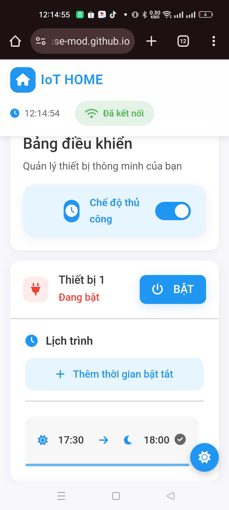

# IoT HOME - Hệ thống điều khiển thiết bị thông minh


Hệ thống điều khiển thiết bị thông minh qua Internet, cho phép người dùng điều khiển các thiết bị điện từ xa thông qua giao diện web.

## Tính năng chính

- 🔌 Điều khiển bật/tắt 2 thiết bị độc lập
- 🕒 Hẹn giờ tự động bật/tắt thiết bị
- 📱 Giao diện responsive, tương thích mobile
- 🌙 Hỗ trợ Dark mode
- 🔄 Tự động cập nhật trạng thái realtime
- 📊 Hiển thị trạng thái kết nối
- 🔒 Chế độ thủ công/tự động
## DEMO:
LINK: https://base-mod.github.io/UI-SMART/
## Công nghệ sử dụng

- HTML5, CSS3, JavaScript
- Firebase Realtime Database
- Bootstrap 5
- Font Awesome 6
- ESP8266/ESP32 (Phần cứng)

## Cài đặt

1. Clone repository:
```bash
git clone https://github.com/your-username/iot-home.git
cd iot-home
```

2. Cấu hình Firebase:
   - Tạo project trên Firebase Console
   - Thêm thông tin cấu hình vào file `script.js`
   - Bật Realtime Database

3. Cấu hình ESP8266/ESP32:
   - Upload code vào ESP8266
   - Cập nhật thông tin WiFi và Firebase
   - Kết nối các relay với ESP8266

4. Chạy ứng dụng:
   - Mở file `index.html` trên trình duyệt
   - Hoặc deploy lên web hosting

## Cấu trúc dự án

```
iot-home/
├── index.html          # Giao diện người dùng
├── styles.css         # Styles và giao diện
├── script.js         # Logic xử lý và Firebase
├── README.md        # Tài liệu dự án
└── firebase-config.js        # setup api Firebase
```

## Sử dụng

1. **Điều khiển thủ công:**
   - Chuyển sang chế độ thủ công
   - Nhấn nút để bật/tắt thiết bị

2. **Hẹn giờ tự động:**
   - Chuyển sang chế độ tự động
   - Thêm lịch trình mới
   - Thiết lập thời gian bật/tắt

3. **Dark mode:**
   - Nhấn nút mặt trời/mặt trăng để chuyển đổi
4. **Giao diện:**



## Đóng góp

Mọi đóng góp đều được chào đón! Hãy tạo pull request hoặc báo cáo lỗi qua mục Issues.


## Tác giả

- **Hao Nguyen** - [GitHub](https://github.com/BaseMod)

## Liên hệ

Nếu có bất kỳ câu hỏi hoặc góp ý nào, vui lòng liên hệ:
- Email: tanhaonguyen0402@gmail.com
- Website: https://basemodpro.com 